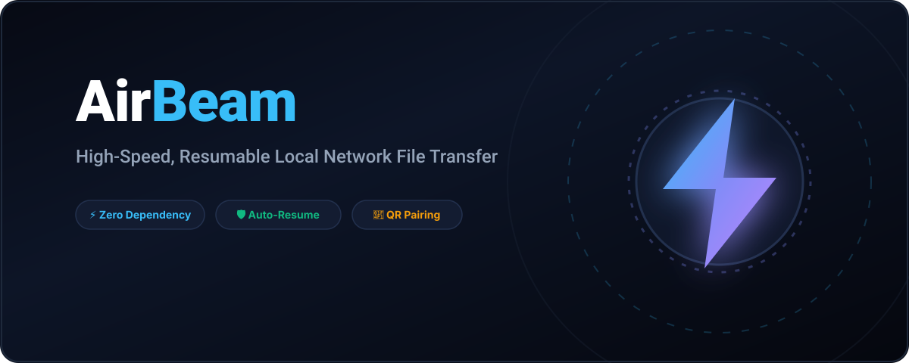
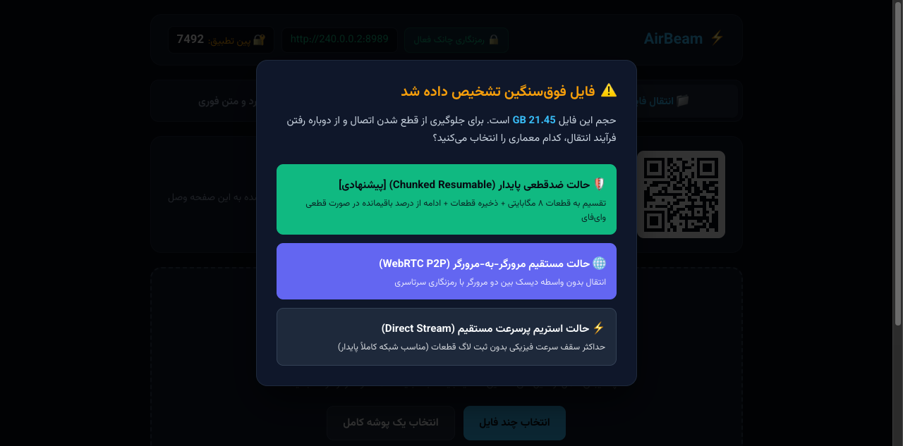

<p align="center">
  
</p>

# AirBeam ⚡

<p align="center">
  
</p>

<p align="center">
  <strong>انتقال فایل محلی فوق‌سریع، سبک و ضدقطعی (Resumable) برای شبکه‌های LAN / Wi-Fi</strong>
</p>

<p align="center">
  <a href="https://devsponsors.github.io"></a>
  <a href="https://devsponsors.github.io"></a>
  <a href="https://devsponsors.github.io"></a>
  <a href="https://devsponsors.github.io/mediakit.html"></a>

  
  
</p>

---

بدون نیاز به اینترنت، بدون نیاز به نصب نرم‌افزار روی دستگاه مقصد، و **بدون حتی یک وابستگی خارجی** (Zero Dependencies - فقط کتابخانه استاندارد پایتون).

---

## 📸 نمای محیط برنامه (Preview)

### داشبورد اصلی و اشتراک با QR Code:


### ویزارد هوشمند مدیریت فایل‌های سنگین (Large File Wizard):


---

## ⚡ اجرای تک‌دستوری (One-Liner Execution)

نیاز به نصب یا کلون دستی هم ندارید؛ با یکی از دستورات زیر برنامه بلافاصله اجرا شده، **اولین پورت آزاد شبکه** را انتخاب کرده و مرورگر را اتوماتیک باز می‌کند:

### در مک (macOS) و لینوکس:
```bash
curl -sSL https://raw.githubusercontent.com/ketabchi-ar/airbeam/main/airbeam.py | python3
```

### در ویندوز (PowerShell):
```powershell
irm https://raw.githubusercontent.com/ketabchi-ar/airbeam/main/airbeam.py | python
```

*(یا کلون سنتی: `git clone https://github.com/ketabchi-ar/airbeam.git && cd airbeam && python3 airbeam.py`)*

---

## ✨ قابلیت‌های کلیدی

- **🛡️ ضد قطعی و ادامه خودکار (Resumable Chunking):** فایل‌ها به قطعات ۸ مگابایتی تقسیم می‌شوند. در صورت نوسان وای‌فای، اسلیپ دستگاه یا بستن تب، انتقال از بایت باقیمانده ادامه می‌یابد و از نو شروع نمی‌شود.
- **🧙‍♂️ ویزارد انتخاب استراتژی انتقال (Smart Wizard):** برای فایل‌های حجیم (+۱ گیگابایت)، ویزارد هوشمند باز شده و بهترین سناریوی انتقال (پایدار یا مستقیم) را پیشنهاد می‌دهد.
- **📱 جفت‌سازی فوری با QR Code (Zero-Type UX):** بدون نیاز به تایپ دستی IP؛ فقط اسکن بارکد با دوربین گوشی یا لپ‌تاپ طرف مقابل.
- **📁 پشتیبانی از انتقال پوشه کامل (Folder Drag & Drop):** ارسال کل یک پوشه همراه تمام زیرپوشه‌ها و فایل‌ها بدون نیاز به فشرده‌سازی و Zip.
- **🔌 تشخیص خودکار پورت آزاد:** اگر پورت پیش‌فرض پر باشد، خودکار اولین پورت آزاد را پیدا کرده و با آن بالا می‌آید.
- **🌐 باز شدن خودکار مرورگر:** به محض اجرا، تب کنترل پنل روی سیستم شما باز می‌شود.
- **🗑️ مدیریت و حذف فایل‌ها از داخل وب:** امکان حذف فایل‌های به اشتراک‌گذاشته شده با یک کلیک.
- **📋 اشتراک فوری کلیپ‌بورد (Instant Text Sync):** تب مجزا برای تبادل سریع پسوردها، لینک‌ها و متون.
- **🔒 پین‌کد امنیتی (Security PIN):** جلوگیری از اتصالات ناخواسته افراد ناشناس در وای‌فای‌های عمومی.
- **☕ بیدار نگه‌داشتن صفحه (Screen Wake Lock):** جلوگیری از Sleep شدن سیستم و قطع شبکه حین انتقال.
- **🎨 طراحی Dark Mode با فونت وزیرمتن.**

---

## 📶 شرایط اتصال و پیش‌نیازها

1. هر دو دستگاه (فرستنده و گیرنده) باید به **یک شبکه وای‌فای یا مودم/سوئیچ LAN مشترک** وصل باشند (نیازی به اتصال اینترنت جهانی نیست).
2. دستگاه مقابل هیچ نرم‌افزاری لازم ندارد؛ تنها کافیست لینک یا QR Code را با هر مرورگری باز کند.

---

## ⚙️ تنظیمات پیشرفته (اختیاری)

برای تغییر پورت پیش‌فرض یا مسیر ذخیره فایل‌ها:

```bash
# لینوکس و مک:
export AIRBEAM_PORT=9090
export AIRBEAM_STORAGE="/مسیر/دلخواه/شما"
python3 airbeam.py

# ویندوز (PowerShell):
$env:AIRBEAM_PORT="9090"
$env:AIRBEAM_STORAGE="D:\\SharedFiles"
python airbeam.py
```

---

## 📄 لایسنس

این پروژه تحت مجوز [MIT](LICENSE) منتشر شده است. استفاده، شخصی‌سازی و توسعه آن کاملاً آزاد است.
